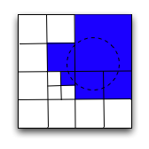
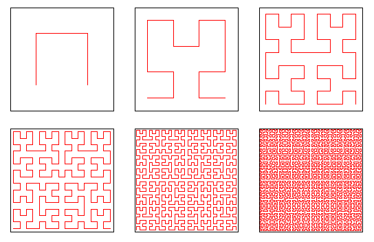
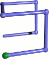
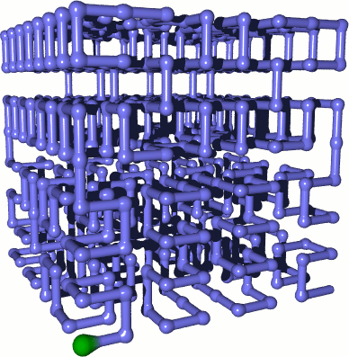

# Progetto Informatica Biomedica (Web-Index)
# Andrea Patrizio

## Progettazione ed implementazione di un Partizionatore Classico 

## Problemi da affrontare

* A partire da un grosso modello, partizionarlo in cluster di punti
* Salvataggio dei cluster su MongoDB attraverso file JSON
* Definizione di una funzione di retrieve

## Utilizzo di tecniche Geohash

### Partizionamento 2D

### Albero delle partizioni

### Retrieve dei dati

## Utilizzo delle curve di Hilbert

### Sviluppo della curva in 2D

### Sviluppo della curva in 3D

